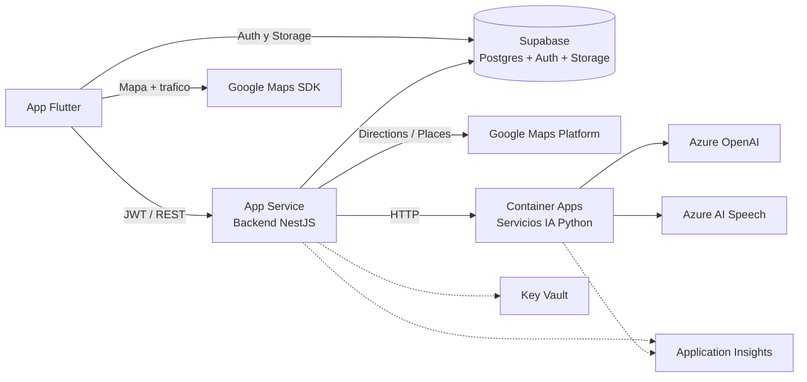

# Ayni Ruta — Recursos de Azure

> Supabase cubre **base de datos (Postgres), autenticación y almacenamiento de archivos**. Todo lo demás corre en Azure. Este documento lista qué recursos de Azure necesita el proyecto y para qué sirve cada uno.

## Recursos necesarios

| # | Recurso | Para qué lo usamos |
|---|---|---|
| 1 | **Grupo de recursos** (`rg-ayni-ruta`) | Contenedor lógico único donde vive todo lo del proyecto; permite borrar/gestionar todo junto y controlar costos. |
| 2 | **Azure App Service (Linux, plan B1)** | Hosting del backend NestJS. Expone la API REST `https://.../api/v1` que consume la app Flutter. Deploy directo desde GitHub. |
| 3 | **Azure AI Foundry (Agent Service)** | El agente de IA del proyecto vive aquí: el backend le manda cada consulta (chat, voz, huecos de información) vía REST (threads/runs) y lee la respuesta. Reemplaza a los servicios Python propios. |
| 4 | **Azure Container Registry** *(opcional)* | Registro privado de imágenes Docker si el backend se contenedoriza. |
| 5 | **Modelo desplegado en Azure AI Foundry** | El deployment del LLM (ej. gpt-4o-mini) que usa el agente; se gestiona dentro del mismo recurso de Foundry. |
| 6 | **Azure AI Speech** | Speech-to-text y text-to-speech en español para el modo de accesibilidad (personas no videntes), cuando las capacidades nativas del teléfono no alcanzan. |
| 7 | **Azure Key Vault** | Guarda los secretos (service role key de Supabase, API key de Google Maps, claves de OpenAI/Speech) sin exponerlos en código ni variables planas. |
| 8 | **Application Insights** | Monitoreo del backend y servicios IA: logs, errores, tiempos de respuesta. Clave para diagnosticar en vivo durante el demo. |
| 9 | **Azure Cache for Redis (Basic)** *(opcional)* | Cache de respuestas de Google Directions y de posiciones estimadas de transporte, para reducir latencia y costo de la API de Google. |
| 10 | **Azure Notification Hubs** *(futuro)* | Notificaciones push (avisos de bloqueos en rutas frecuentes, alertas de zona de riesgo). No se necesita para el demo. |

## Servicios externos (no Azure) que completan el mapa

| Servicio | Para qué |
|---|---|
| **Supabase** | Postgres (+PostGIS), Auth (JWT) y Storage (fotos de reportes). |
| **Google Maps Platform** | Directions (tiempos/distancias reales), Places (autocompletado) y capa de tráfico en el mapa del cliente. |

## Notas de costos para la hackatón

- Con la suscripción gratuita/de estudiante alcanza: App Service B1, Container Apps con consumo, ACR Basic y Application Insights entran en niveles gratis o de bajo costo.
- Azure OpenAI requiere solicitud de acceso; alternativa rápida si no llega a tiempo: usar la API de Anthropic/OpenAI directa desde el servicio Python y dejar Azure OpenAI documentado como destino final.
- Redis y Notification Hubs son opcionales: no bloquean el demo del 21 de julio.

## Diagrama de despliegue

